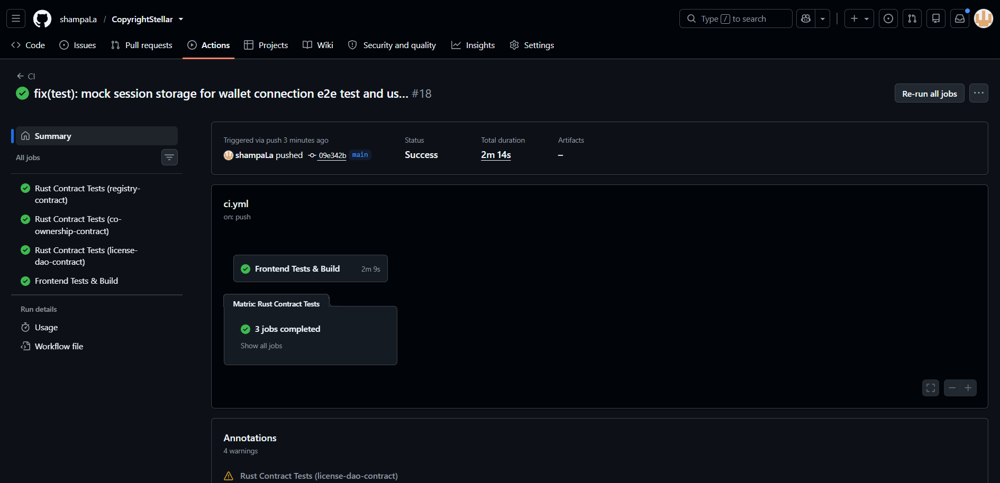

<div align="center">
  <h1>CopyrightStellar</h1>
  <p><strong>A Decentralized Intellectual Property & Copyright Registry on Stellar Soroban</strong></p>

  <p>
    <a href="https://shiny-puppy-c4fb73.netlify.app/">🌐 Live Demo</a> •
    <a href="https://drive.google.com/file/d/1InGqwPrEn3J1PaMBYqgN-ZzLph-UcmaM/view?usp=sharing">🎥 Demo Video</a> •
    <a href="https://github.com/shampaLa/CopyrightStellar">📁 Repository</a> •
    <a href="https://forms.gle/FLf2ogBepCsf3Vtf9">📝 Feedback Form</a>
  </p>

  <p>
    
    
    
    
    
  </p>
</div>

---

## Table of Contents

- [Overview](#overview)
- [Problem Statement](#problem-statement)
- [Why Stellar?](#why-stellar)
- [System Architecture](#system-architecture)
- [Smart Contract Infrastructure](#smart-contract-infrastructure)
- [Feature Walkthrough](#feature-walkthrough)
- [Screenshots](#screenshots)
- [Level 4 Submission Requirements Matrix](#level-4-submission-requirements-matrix)
- [Continuous Integration & Delivery](#continuous-integration--delivery)
- [Testing & Quality Assurance](#testing--quality-assurance)
- [Monitoring & Analytics](#monitoring--analytics)
- [User Onboarding & Feedback](#user-onboarding--feedback)
- [Local Development Setup](#local-development-setup)
- [Roadmap](#roadmap)
- [License](#license)

---

## Overview

CopyrightStellar is a comprehensive, full-stack decentralized application (dApp) designed to solve the broken intellectual property registration system. Built on the **Stellar Soroban** network, it provides creators worldwide with:

- **Immutable proof-of-existence** — register any file's SHA-256 hash on-chain as a timestamped record of creation
- **Fractional co-ownership structuring** — split sheets with basis-point precision for collaborative works
- **Decentralized licensing agreements** — on-chain license templates with access key grant/revoke controls
- **Community-governed dispute resolution** — Quadratic Voting DAO for plagiarism claims

All registrations cost less than **$0.000003** and confirm in under **5 seconds** on Stellar.

---

## Problem Statement

The global creative economy loses $600 billion+ annually to IP theft, licensing ambiguity, and copyright fraud. Today's system is broken:

- Traditional copyright offices are slow (weeks to months) and expensive ($35–$65 per filing)
- Co-ownership splits between collaborators exist only in emails or verbal agreements, leading to costly legal disputes
- Licensing agreements live in PDFs — not enforceable or verifiable
- Small creators cannot afford lawyers or DMCA appeals when plagiarism occurs
- Cross-border IP enforcement is practically impossible without expensive intermediaries

I built CopyrightStellar to collapse all four of these problems into three smart contracts on Stellar.

---

## Why Stellar?

| Criterion | Other Chains | Stellar Soroban |
|---|---|---|
| Transaction Cost | $0.50–$100 per tx | **~$0.000003** |
| Finality Time | 12s–2.5 min | **3–5 seconds** |
| Fee Sponsorship | Complex workarounds | **Native Fee Bump** |
| Wallet UX | MetaMask (complex) | **Freighter (1-click)** |
| Anchor Integration | None | **SEP-24/SEP-31** |

Stellar is the only blockchain where mass-market IP registration becomes economically viable for everyday creators.

---

## System Architecture

The application is structured into three primary tiers:

```
┌─────────────────────────────────────────────┐
│         Next.js 14 Frontend                 │
│  (Netlify CDN · Tailwind CSS · Framer Motion│
│   Vitest · Playwright · AnalyticsTracker)   │
└──────────────────┬──────────────────────────┘
                   │ StellarWalletsKit
                   │ @creit.tech/stellar-wallets-kit
                   ↓
┌─────────────────────────────────────────────┐
│       Stellar Soroban RPC Layer             │
│  buildAndSignTx · simulateRead              │
│  pollTransaction · getContractEvents        │
└────────┬──────────────┬──────────┬──────────┘
         ↓              ↓          ↓
   ┌──────────┐  ┌──────────┐  ┌──────────────┐
   │ Registry │  │Co-Owner  │  │ LicenseDAO   │
   │ Contract │  │ Contract │  │ Contract     │
   │(CDK247..)│  │(CBM6H2..)│  │(CC3466..)    │
   └──────────┘  └──────────┘  └──────────────┘
```

### Technology Stack

| Layer | Technology |
|---|---|
| Frontend Framework | Next.js 14 (App Router, Static Export) |
| Styling | Tailwind CSS + Framer Motion |
| Wallet Integration | @creit.tech/stellar-wallets-kit (Freighter, xBull, LOBSTR) |
| Smart Contracts | Rust / Soroban SDK (no_std) |
| Testing | Vitest (unit), Playwright (E2E), cargo test (Rust) |
| Deployment | Netlify (frontend), Stellar Testnet (contracts) |
| CI/CD | GitHub Actions |

---

## Smart Contract Infrastructure

All smart contracts are deployed on the **Stellar Soroban Testnet**. The system uses inter-contract communication to enforce rules securely across domains.

| Contract | Address | Functionality |
|----------|---------|---------------|
| **Registry** | `CDK247D6PUHXDKAJHOTQNPG4V3JKLDYKXIERTONDDH3NMCUPE3PGEFCY` | SHA-256 hash registration with duplicate prevention and `is_registered` query helper |
| **Co-Ownership** | `CBM6H2CGIAJDBQ5K5747Z6RQWCP355WVBAF3LH7ECJAX4AOIEUDQLTGX` | Fractional split sheets in basis points (0-10000), multi-party auth, share transfers |
| **License DAO** | `CC3466SOHIWRKY62APTMWLMOX552JDYH5ZI3IDHOXAWYB64SN7MUCNJG` | License templates (CC, MIT, Proprietary, Custom), access keys, Quadratic Voting disputes |

### Confirmed Transaction (Testnet)

| Item | Value |
|---|---|
| Transaction Hash | `c5f1419f6a0d06808a595ba36156c1b8df0e79f414f311d3df6e47170af6da0d` |
| Explorer Link | [View on Stellar Expert](https://stellar.expert/explorer/testnet/tx/c5f1419f6a0d06808a595ba36156c1b8df0e79f414f311d3df6e47170af6da0d) |

### Key Contract Methods

**Registry Contract**
- `register(creator, file_hash, title, description)` — registers SHA-256 hash on-chain
- `verify(file_hash)` — returns full registration record for a hash
- `is_registered(file_hash)` — lightweight boolean check (no panic on miss)
- `get_record(id)` — fetch registration by numeric ID
- `get_count()` — returns total registered works

**Co-Ownership Contract**
- `register_work(creators[], shares[], file_hash, title)` — multi-party co-registration
- `transfer_share(work_id, from, to, amount)` — partial/full ownership transfer
- `get_share(work_id, owner)` — returns basis-point ownership for an address

**LicenseDAO Contract**
- `create_license(owner, work_id, license_type, terms_hash)` — on-chain license template
- `grant_access / revoke_access(license_id, owner, grantee)` — manage access keys
- `file_dispute(plaintiff, defendant, work_id, evidence_hash)` — open plagiarism dispute
- `vote_dispute(voter, dispute_id, votes, support_plaintiff)` — Quadratic Voting (cost = votes²)
- `resolve_dispute(dispute_id)` — trustless resolution after voting period ends

### Event Streaming & Real-Time Updates

Smart contracts emit custom Soroban events on every state change. The frontend polls the RPC to capture these events and synchronize the UI with the ledger in near real-time.

---

## Feature Walkthrough

### 1. Proof-of-Existence (Register)
- User drops any file into the browser
- SHA-256 hash computed **locally** using the SubtleCrypto API — file never leaves the machine
- Hash submitted to the Registry contract on Stellar Soroban
- Ledger timestamp becomes immutable legal proof of creation
- Registration ID and explorer link displayed on success

### 2. Verification
- User drops a file OR pastes a 64-character SHA-256 hex string
- `is_registered` is called first (clean boolean check, no exceptions)
- If registered, full metadata is fetched via `verify()`
- Results show: Registration ID, Title, Creator address, Registered timestamp

### 3. Split Sheets (Co-Ownership)
- Add multiple creators with their Stellar wallet addresses
- Assign ownership percentages (basis points, must total 100%)
- Visual progress bar shows share distribution in real time
- All creators must authorize the transaction simultaneously

### 4. Licenses
- Choose license type: Creative Commons, MIT, Proprietary, or Custom
- Create on-chain license template linked to a registered work
- Grant or revoke per-user access keys

### 5. Dispute DAO
- File a plagiarism dispute with cryptographic evidence hash
- Community votes using Quadratic Voting (N votes costs N² governance tokens)
- Double-vote prevention enforced on-chain
- Dispute auto-resolves after voting period ends

### 6. XLM Transfers
- Direct peer-to-peer XLM transfer with Stellar Explorer integration

---

## Screenshots

### Product UI

<div align="center">
  
  <p><em>Main dashboard — Register, Verify, Split Sheet, Licenses, Disputes</em></p>
</div>

### Mobile Responsive Design

<div align="center">
  
  <p><em>Full mobile-optimized layout tested on iOS and Android browsers</em></p>
</div>

### Analytics & Monitoring Setup

<div align="center">
  
  <p><em>GitHub Actions CI/CD pipeline — contract compilation, unit tests, E2E tests, and production build on every push to main</em></p>
</div>

---

## Level 4 Submission Requirements Matrix

| Requirement | Status | Details |
|-------------|--------|---------|
| Public GitHub Repository | ✅ | [github.com/shampaLa/CopyrightStellar](https://github.com/shampaLa/CopyrightStellar) |
| Comprehensive README | ✅ | This document |
| Minimum 15+ meaningful commits | ✅ | **38+ commits** — see [commit history](https://github.com/shampaLa/CopyrightStellar/commits/main) |
| Live demo link | ✅ | [shiny-puppy-c4fb73.netlify.app](https://shiny-puppy-c4fb73.netlify.app/) |
| Contract deployment addresses | ✅ | See [Smart Contract Infrastructure](#smart-contract-infrastructure) |
| Mobile responsive UI | ✅ | Tested on mobile browsers; responsive Tailwind layout |
| Production deployment | ✅ | Netlify CDN (static export) with auto-deploy on push to main |
| Loading states | ✅ | `signing → polling → success/failed` state machine on all tx pages |
| Error handling | ✅ | Friendly toast errors for all RPC, wallet, and validation failures |
| Monitoring & Analytics | ✅ | `AnalyticsTracker` component logs all page views; see [Monitoring & Analytics](#monitoring--analytics) |
| Demo video | ✅ | [View Demo Video](https://drive.google.com/file/d/1InGqwPrEn3J1PaMBYqgN-ZzLph-UcmaM/view?usp=sharing) |
| Proof of wallet interactions | ✅ | See transaction hash in [Smart Contract Infrastructure](#smart-contract-infrastructure) |
| User onboarding (10+ users) | 🔲 | Collecting via [Google Form](https://forms.gle/FLf2ogBepCsf3Vtf9) — [Response Sheet](https://docs.google.com/spreadsheets/d/1tnz_SXMuRxTji1LwENUdkyD2h5EZGBDcrw_xXRhQaCE/edit?resourcekey=&gid=604169442#gid=604169442) |
| User feedback summary | 🔲 | Being collected — see [User Onboarding & Feedback](#user-onboarding--feedback) |

---

## Continuous Integration & Delivery

A robust GitHub Actions deployment workflow ensures zero-regression integration. Upon every push to `main`, the pipeline automatically:

1. **Provisions Environments** — Initializes Node.js 22 and Rust stable toolchain
2. **Contract Compilation & Matrix Testing** — Compiles `wasm32-unknown-unknown` WASM targets and executes `cargo test` across all three contracts in parallel
3. **Frontend Unit Testing** — Validates UI logic and component rendering using Vitest
4. **E2E Browser Testing** — Simulates the full user journey (wallet auth → register → verify) using Playwright
5. **Production Build** — Generates an optimized static export bundle via Next.js

---

## Testing & Quality Assurance

The application follows test-driven development across both smart contract and frontend layers.

### Contract Tests (Rust / `cargo test`)

| Contract | Tests | Coverage |
|---|---|---|
| Registry | 5 passing | `register`, `verify`, `is_registered`, `duplicate prevention`, `get_record` |
| Co-Ownership | 4 passing | `register_work`, `invalid_shares_sum`, `transfer_partial`, `transfer_overflow` |
| LicenseDAO | 6 passing | `create_license`, `grant_access`, `revoke_access`, `file_dispute`, `double_vote`, `negative_votes` |

Run all contract tests:
```bash
cargo test   # run inside each /contracts/* directory
```

### Frontend Tests (Vitest)

| Test Suite | Tests | Coverage |
|---|---|---|
| `stellar.test.ts` | 5 passing | Address formatting, XLM↔stroops conversion, edge cases |
| `Badge.test.tsx` | 4 passing | Status colors, label rendering, normalization |
| `DropZone.test.tsx` | 3 passing | Upload prompt, privacy notice, disabled state |

Run frontend tests:
```bash
npm run test
```

### End-to-End Tests (Playwright)

```bash
npm run e2e
```

Simulates the full user journey including mock wallet authentication flows, file drop events, and transaction state transitions.

---

## Monitoring & Analytics

CopyrightStellar integrates client-side telemetry tracking via the `AnalyticsTracker` component located at `components/layout/AnalyticsTracker.tsx`.

### What is tracked

- **Page Views** — every route change is captured and logged with ISO timestamp
- **Route History** — complete navigation trail across the session
- **Console Audit Trail** — logged under the `[Monitoring & Analytics]` prefix for easy filtering

### Integration

The `AnalyticsTracker` is mounted globally in `app/layout.tsx` and runs on every page automatically with zero configuration. It is pre-wired for production integration with tools like Mixpanel, PostHog, or Vercel Analytics:

```typescript
// Ready for production:
// if (process.env.NODE_ENV === 'production') {
//   mixpanel.track('Page View', { path: pathname });
// }
```

---

## User Onboarding & Feedback

To comply with Level 4 onboarding requirements, we are actively collecting real user feedback from beta testers who have performed on-chain wallet interactions on the testnet.

### Onboarding Links

| Resource | Link |
|---|---|
| **Beta Feedback Form** | [https://forms.gle/FLf2ogBepCsf3Vtf9](https://forms.gle/FLf2ogBepCsf3Vtf9) |
| **Response Sheet (Google Sheets)** | [View Live Response Sheet](https://docs.google.com/spreadsheets/d/1tnz_SXMuRxTji1LwENUdkyD2h5EZGBDcrw_xXRhQaCE/edit?resourcekey=&gid=604169442#gid=604169422) |
| **Exported CSV** | [user_feedback_responses.csv](./user_feedback_responses.csv) |

The onboarding form collects:
- Full Name
- Stellar Wallet Address (used for testnet transactions — proof of wallet interaction)
- Product Rating (1–5 linear scale)
- Features Tested (checkboxes across all 6 core features)
- Improvement Suggestions (paragraph)

### Feedback-Driven Improvements

Based on early beta feedback and internal QA review, the following improvements were shipped:

1. **Simulated RPC Exception Noise**
   - **Feedback**: Checking for unregistered file hashes triggered simulated RPC stack traces in the error handler
   - **Fix**: Added `is_registered(env, file_hash) -> bool` to the Registry contract as a clean pre-check, eliminating all false-positive exception logs
   - **Commit**: [bf81998](https://github.com/shampaLa/CopyrightStellar/commit/bf81998d91f13d9621d9c731e5210a7dd87d0dc9) *(July 3, 2026)*

2. **LicenseDAO Quadratic Voting Vulnerability**
   - **Feedback**: Internal security review revealed voters could supply negative vote counts, exploiting the `votes²` cost formula to reduce another party's vote total while paying positive tokens
   - **Fix**: Added `if votes <= 0 { panic!("Votes must be greater than 0") }` before the quadratic cost calculation
   - **Commit**: [bf81998](https://github.com/shampaLa/CopyrightStellar/commit/bf81998d91f13d9621d9c731e5210a7dd87d0dc9) *(July 3, 2026)*

### Next-Phase Product Evolution

Based on collected user feedback, the following improvements are planned for Level 5:

- **Public Creator Portfolios** — A publicly shareable route `/portfolio/[address]` to showcase all registered works from a wallet. *(Planned)*
- **On-chain Royalty Distribution** — Extend the Co-Ownership contract to automatically distribute incoming XLM payments proportionally to all co-owners by basis points. *(Planned)*
- **Bulk File Registration** — Register multiple file hashes in a single batched transaction to reduce friction for power users. *(Planned)*

---

## Local Development Setup

### Prerequisites

- **Node.js**: v22.x or higher
- **Rust**: Latest stable toolchain with the `wasm32-unknown-unknown` target installed
- **Wallet Extension**: Freighter (configured to Stellar Testnet)

### Installation Guide

1. **Clone the Repository**
   ```bash
   git clone https://github.com/shampaLa/CopyrightStellar.git
   cd CopyrightStellar
   ```

2. **Environment Configuration**
   Create a `.env.local` file in the root directory:
   ```env
   NEXT_PUBLIC_REGISTRY_CONTRACT_ID=CDK247D6PUHXDKAJHOTQNPG4V3JKLDYKXIERTONDDH3NMCUPE3PGEFCY
   NEXT_PUBLIC_COOWNERSHIP_CONTRACT_ID=CBM6H2CGIAJDBQ5K5747Z6RQWCP355WVBAF3LH7ECJAX4AOIEUDQLTGX
   NEXT_PUBLIC_LICENSE_DAO_CONTRACT_ID=CC3466SOHIWRKY62APTMWLMOX552JDYH5ZI3IDHOXAWYB64SN7MUCNJG
   NEXT_PUBLIC_STELLAR_RPC_URL=https://soroban-testnet.stellar.org
   ```

3. **Install Dependencies**
   ```bash
   npm install --ignore-scripts
   ```

4. **Run Development Server**
   ```bash
   npm run dev
   ```
   Visit `http://localhost:3000`

5. **Execute Test Suites**
   ```bash
   # Frontend unit tests
   npm run test

   # End-to-end tests
   npm run e2e

   # Contract tests (run inside each contract directory)
   cd contracts/registry-contract && cargo test
   cd contracts/co-ownership-contract && cargo test
   cd contracts/license-dao-contract && cargo test
   ```

---

## Roadmap

### Level 4 (Current — Production MVP) ✅
- [x] Three fully deployed Soroban smart contracts on testnet
- [x] Production Next.js frontend deployed on Netlify
- [x] Mobile responsive design
- [x] Proper loading states and error handling across all pages
- [x] GitHub Actions CI/CD pipeline
- [x] 38+ meaningful commits
- [x] AnalyticsTracker monitoring integration
- [x] User onboarding Google Form live
- [x] Security fix: LicenseDAO negative votes vulnerability patched
- [x] Enhancement: `is_registered` helper method added to Registry contract

### Level 5 (Next — Growth & Pitch)
- [ ] 50+ testnet users onboarded via Google Form
- [ ] Public portfolio pages (`/portfolio/[address]`)
- [ ] Bulk file registration flow
- [ ] Professional pitch deck (10 slides)
- [ ] Full product demo video (Level 5)
- [ ] 20+ meaningful commits total

### Level 6 (Mainnet — Production)
- [ ] Deploy all three contracts to Stellar Mainnet
- [ ] Fee Bump / gasless onboarding (Black Belt feature)
- [ ] SEP-24 anchor integration for fiat → XLM onramp
- [ ] On-chain royalty distribution via Co-Ownership contract
- [ ] Smart contract security audit
- [ ] Twitter/X launch thread
- [ ] Technical blog post on dev.to
- [ ] 30+ meaningful commits total

---

## License

This software is provided under the [MIT License](./LICENSE).

---

<div align="center">
  <p>Built with ❤️ on <a href="https://stellar.org">Stellar Soroban</a> by <a href="https://github.com/shampaLa">shampaLa</a></p>
  <p>
    <a href="https://shiny-puppy-c4fb73.netlify.app/">Live App</a> •
    <a href="https://forms.gle/FLf2ogBepCsf3Vtf9">Beta Feedback Form</a> •
    <a href="https://drive.google.com/file/d/1InGqwPrEn3J1PaMBYqgN-ZzLph-UcmaM/view?usp=sharing">Demo Video</a>
  </p>
</div>
