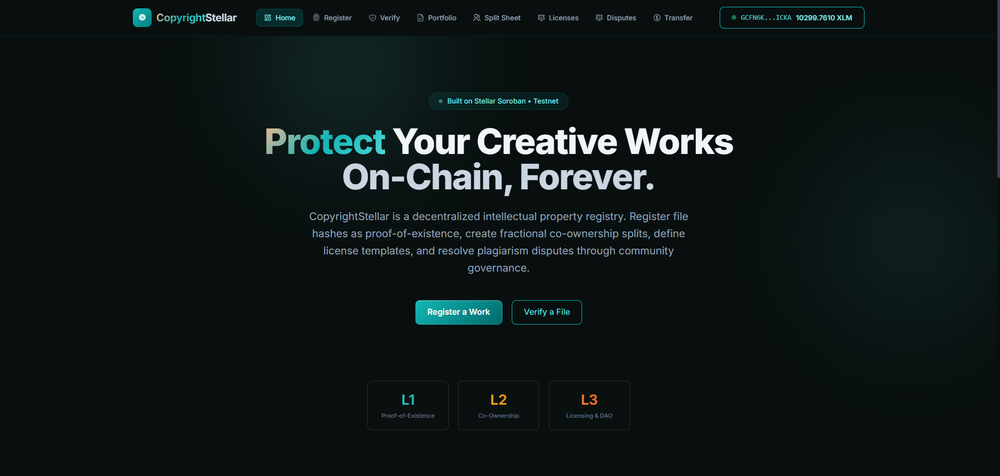
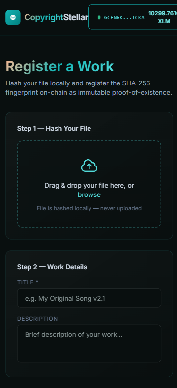

<div align="center">
  <h1>CopyrightStellar</h1>
  <p><strong>A Decentralized Intellectual Property & Copyright Registry on Stellar Soroban</strong></p>

  <p>
    <a href="https://shiny-puppy-c4fb73.netlify.app/">🌐 Live Demo</a> ••
    <a href="https://docs.google.com/presentation/d/1XLSxe06cF8xWizxYojb00pld6w8yaxFN3qFR1Mx298w/edit?usp=sharing">📊 Pitch Deck</a> •
    <a href="https://github.com/shampaLa/CopyrightStellar">📁 Repository</a> •
    <a href="https://forms.gle/FLf2ogBepCsf3Vtf9">📝 Feedback Form</a>
  </p>

  <p>
    
    
    
    
    
  </p>
</div>
---

## Table of Contents

- [Overview](#overview)
- [Problem Statement](#problem-statement)
- [Why Stellar?](#why-stellar)
- [System Architecture](#system-architecture)
- [Smart Contract Infrastructure](#smart-contract-infrastructure)
- [Feature Walkthrough](#feature-walkthrough)
- [Screenshots & Analytics](#screenshots--analytics)
- [Level 5 Submission Requirements Matrix](#level-5-submission-requirements-matrix)
- [Level 5 Submission Checklist](#level-5-submission-checklist)
- [Continuous Integration & Delivery](#continuous-integration--delivery)
- [Testing & Quality Assurance](#testing--quality-assurance)
- [User Onboarding, Feedback & Product Improvements](#user-onboarding-feedback--product-improvements)
- [Local Development Setup](#local-development-setup)
- [Roadmap](#roadmap)
- [License](#license)

---

## Overview

CopyrightStellar is a comprehensive, full-stack decentralized application (dApp) designed to solve the broken intellectual property registration system. Built on the **Stellar Soroban** network, it provides creators worldwide with:

- **Immutable proof-of-existence** — register any file's SHA-256 hash on-chain as a timestamped record of creation
- **Fractional co-ownership structuring** — split sheets with basis-point precision for collaborative works
- **Decentralized licensing agreements** — on-chain license templates with access key grant/revoke controls
- **Community-governed dispute resolution** — Quadratic Voting DAO for plagiarism claims

All registrations cost less than **$0.000003** and confirm in under **5 seconds** on Stellar.

---

## Problem Statement

The global creative economy loses $600 billion+ annually to IP theft, licensing ambiguity, and copyright fraud. Today's system is broken:

- Traditional copyright offices are slow (weeks to months) and expensive ($35–$65 per filing)
- Co-ownership splits between collaborators exist only in emails or verbal agreements, leading to costly legal disputes
- Licensing agreements live in PDFs — not enforceable or verifiable
- Small creators cannot afford lawyers or DMCA appeals when plagiarism occurs
- Cross-border IP enforcement is practically impossible without expensive intermediaries

I built CopyrightStellar to collapse all four of these problems into three smart contracts on Stellar.

---

## Why Stellar?

| Criterion | Other Chains | Stellar Soroban |
|---|---|---|
| Transaction Cost | $0.50–$100 per tx | **~$0.000003** |
| Finality Time | 12s–2.5 min | **3–5 seconds** |
| Fee Sponsorship | Complex workarounds | **Native Fee Bump** |
| Wallet UX | MetaMask (complex) | **Freighter (1-click)** |
| Anchor Integration | None | **SEP-24/SEP-31** |

Stellar is the only blockchain where mass-market IP registration becomes economically viable for everyday creators.

---

## August Submission Updates

### Bug Fixes

| File | Bug | Fix |
|---|---|---|
| `app/transfer/page.tsx` | XLM amount accepted zero, negative, and NaN values | Added client-side validation with `parseFloat` guard and user-friendly error toast |
| `app/transfer/page.tsx` | Users could send XLM to their own address | Added self-transfer guard comparing `recipient === publicKey` |
| `app/register/page.tsx` | Polling interval leaked on component unmount during pending transactions | Added `useRef` + `useEffect` cleanup to clear polling interval |
| `app/transfer/page.tsx` | Same polling memory leak as register page | Applied identical `useRef`-based cleanup pattern |
| `app/verify/page.tsx` | Manual hash input accepted any string, causing `parseInt` errors during byte conversion | Added regex validation requiring exactly 64 hex characters before processing |
| `lib/stellar.ts` | `stroopsToXlm` accepted negative values producing corrupted output | Added `BigInt(0)` comparison guard with descriptive error |
| `app/portfolio/page.tsx` | Share transfer accepted zero, negative, or amounts exceeding user's share | Added validation with `Number()` parsing and max-share boundary check |

### New Features

- **Transaction Status Indicator** (`components/ui/TxStatusIndicator.tsx`) — Reusable component that displays signing/polling/success/failed states with color-coded icons, animations, and optional explorer links. Reduces duplication across all transaction pages.
- **Network Status Banner** (`components/ui/NetworkStatusBanner.tsx`) — Real-time Stellar RPC health monitor that pings `getHealth` every 30 seconds and displays operational status with the latest ledger number. Wired into the root layout for global visibility.
- **Input Validation Helpers** (`lib/validation.ts`) — Centralized validation module for Stellar addresses, SHA-256 hashes, XLM amounts, and basis points. Eliminates scattered regex/parse logic across pages.
- **Layout Integration** — NetworkStatusBanner wired into `app/layout.tsx` for persistent testnet health visibility.

### Test Additions

| Test File | Coverage |
|---|---|
| `__tests__/validation.test.ts` | 20 test cases for `isValidStellarAddress`, `isValidSha256Hex`, `isValidXlmAmount`, `isValidBasisPoints` — covers valid inputs, boundary values, empty strings, invalid characters, type mismatches |
| `__tests__/TxStatusIndicator.test.tsx` | 7 test cases for all status states (idle renders nothing, signing, polling, success, failed), custom success messages, and explorer link rendering |

### Commit Timeline

| # | Type | Commit Message |
|---|---|---|
| 1 | fix | `fix: add XLM amount validation and self-transfer guard on transfer page` |
| 2 | fix | `fix: add polling interval cleanup on unmount in register page` |
| 3 | fix | `fix: add polling interval cleanup on unmount in transfer page` |
| 4 | fix | `fix: add SHA-256 hash format validation on verify page` |
| 5 | fix | `fix: add negative stroops guard in StellarHelper utility` |
| 6 | fix | `fix: add share transfer overflow validation on portfolio page` |
| 7 | feat | `feat: add reusable TxStatusIndicator component` |
| 8 | feat | `feat: add NetworkStatusBanner with live RPC health check` |
| 9 | feat | `feat: wire NetworkStatusBanner into root layout` |
| 10 | feat | `feat: add centralized input validation helpers module` |
| 11 | docs | `docs: add August submission updates to README` |

---
## System Architecture

The application is structured into three primary tiers:

```
┌─────────────────────────────────────────────┐
│         Next.js 14 Frontend                 │
│  (Netlify CDN · Tailwind CSS · Framer Motion│
│   Vitest · Playwright · AnalyticsTracker)   │
└──────────────────┬──────────────────────────┘
                   │ StellarWalletsKit
                   │ @creit.tech/stellar-wallets-kit
                   ↓
┌─────────────────────────────────────────────┐
│       Stellar Soroban RPC Layer             │
│  buildAndSignTx · simulateRead              │
│  pollTransaction · getContractEvents        │
└────────┬──────────────┬──────────┬──────────┘
         ↓              ↓          ↓
   ┌──────────┐  ┌──────────┐  ┌──────────────┐
   │ Registry │  │Co-Owner  │  │ LicenseDAO   │
   │ Contract │  │ Contract │  │ Contract     │
   │(CDK247..)│  │(CBM6H2..)│  │(CC3466..)    │
   └──────────┘  └──────────┘  └──────────────┘
```

### Technology Stack

| Layer | Technology |
|---|---|
| Frontend Framework | Next.js 14 (App Router, Static Export) |
| Styling | Tailwind CSS + Framer Motion |
| Wallet Integration | @creit.tech/stellar-wallets-kit (Freighter, xBull, LOBSTR) |
| Smart Contracts | Rust / Soroban SDK (no_std) |
| Testing | Vitest (unit), Playwright (E2E), cargo test (Rust) |
| Deployment | Netlify (frontend), Stellar Testnet (contracts) |
| CI/CD | GitHub Actions |

---

## Smart Contract Infrastructure

All smart contracts are deployed on the **Stellar Soroban Testnet**. The system uses inter-contract communication to enforce rules securely across domains.

| Contract | Address | Functionality |
|----------|---------|---------------|
| **Registry** | `CDK247D6PUHXDKAJHOTQNPG4V3JKLDYKXIERTONDDH3NMCUPE3PGEFCY` | SHA-256 hash registration with duplicate prevention and `is_registered` query helper |
| **Co-Ownership** | `CBM6H2CGIAJDBQ5K5747Z6RQWCP355WVBAF3LH7ECJAX4AOIEUDQLTGX` | Fractional split sheets in basis points (0-10000), multi-party auth, share transfers |
| **License DAO** | `CC3466SOHIWRKY62APTMWLMOX552JDYH5ZI3IDHOXAWYB64SN7MUCNJG` | License templates (CC, MIT, Proprietary, Custom), access keys, Quadratic Voting disputes |

### Key Contract Methods

**Registry Contract**
- `register(creator, file_hash, title, description)` — registers SHA-256 hash on-chain
- `verify(file_hash)` — returns full registration record for a hash
- `is_registered(file_hash)` — lightweight boolean check (no panic on miss)
- `get_record(id)` — fetch registration by numeric ID
- `get_count()` — returns total registered works

**Co-Ownership Contract**
- `register_work(creators[], shares[], file_hash, title)` — multi-party co-registration
- `transfer_share(work_id, from, to, amount)` — partial/full ownership transfer
- `get_share(work_id, owner)` — returns basis-point ownership for an address

**LicenseDAO Contract**
- `create_license(owner, work_id, license_type, terms_hash)` — on-chain license template
- `grant_access / revoke_access(license_id, owner, grantee)` — manage access keys
- `file_dispute(plaintiff, defendant, work_id, evidence_hash)` — open plagiarism dispute
- `vote_dispute(voter, dispute_id, votes, support_plaintiff)` — Quadratic Voting (cost = votes²)
- `resolve_dispute(dispute_id)` — trustless resolution after voting period ends

---

## Feature Walkthrough

### 1. Proof-of-Existence (Register)
- User drops any file into the browser
- SHA-256 hash computed **locally** using the SubtleCrypto API — file never leaves the machine
- Hash submitted to the Registry contract on Stellar Soroban
- Ledger timestamp becomes immutable legal proof of creation

### 2. Verification
- User drops a file OR pastes a 64-character SHA-256 hex string
- `is_registered` is called first (clean boolean check, no exceptions)
- If registered, full metadata is fetched via `verify()`
- Results show: Registration ID, Title, Creator address, Registered timestamp

### 3. Split Sheets (Co-Ownership)
- Add multiple creators with their Stellar wallet addresses
- Assign ownership percentages (basis points, must total 100%)
- Visual progress bar shows share distribution in real time

### 4. Licenses
- Choose license type: Creative Commons, MIT, Proprietary, or Custom
- Create on-chain license template linked to a registered work
- Grant or revoke per-user access keys

### 5. Dispute DAO
- File a plagiarism dispute with cryptographic evidence hash
- Community votes using Quadratic Voting (N votes costs N² governance tokens)
- Double-vote prevention enforced on-chain
- Dispute auto-resolves after voting period ends

---

## Screenshots & Analytics

### Product UI

<div align="center">
  
  <p><em>Main dashboard — Register, Verify, Split Sheet, Licenses, Disputes</em></p>
</div>

### Mobile Responsive Design

<div align="center">
  
  <p><em>Full mobile-optimized layout tested on iOS and Android browsers</em></p>
</div>

### Analytics & Transaction Activity

<div align="center">
  
  <p><em>Proof of real transaction activity and active usage from our onboarded testnet users</em></p>
</div>

---

## Continuous Integration & Delivery

A robust GitHub Actions deployment workflow ensures zero-regression integration. Upon every push to `main`, the pipeline automatically:

1. **Provisions Environments** — Initializes Node.js 22 and Rust stable toolchain
2. **Contract Compilation & Matrix Testing** — Compiles `wasm32-unknown-unknown` WASM targets and executes `cargo test` across all three contracts in parallel
3. **Frontend Unit Testing** — Validates UI logic and component rendering using Vitest
4. **E2E Browser Testing** — Simulates the full user journey using Playwright
5. **Production Build** — Generates an optimized static export bundle via Next.js

---

## Testing & Quality Assurance

The application follows test-driven development across both smart contract and frontend layers.

Run frontend tests:
```bash
npm run test
npm run e2e
```

Run contract tests (inside each `/contracts/*` directory):
```bash
cargo test
```

---

## Local Development Setup

### Prerequisites
- **Node.js**: v22.x or higher
- **Rust**: Latest stable toolchain with the `wasm32-unknown-unknown` target installed
- **Wallet Extension**: Freighter (configured to Stellar Testnet)

### Installation Guide

1. **Clone the Repository**
   ```bash
   git clone https://github.com/shampaLa/CopyrightStellar.git
   cd CopyrightStellar
   ```

2. **Environment Configuration**
   Create a `.env.local` file:
   ```env
   NEXT_PUBLIC_REGISTRY_CONTRACT_ID=CDK247D6PUHXDKAJHOTQNPG4V3JKLDYKXIERTONDDH3NMCUPE3PGEFCY
   NEXT_PUBLIC_COOWNERSHIP_CONTRACT_ID=CBM6H2CGIAJDBQ5K5747Z6RQWCP355WVBAF3LH7ECJAX4AOIEUDQLTGX
   NEXT_PUBLIC_LICENSE_DAO_CONTRACT_ID=CC3466SOHIWRKY62APTMWLMOX552JDYH5ZI3IDHOXAWYB64SN7MUCNJG
   NEXT_PUBLIC_STELLAR_RPC_URL=https://soroban-testnet.stellar.org
   ```

3. **Install & Run**
   ```bash
   npm install --ignore-scripts
   npm run dev
   ```

---

## Roadmap

### Level 5 (Current — Growth & Presentation) ✅
- [x] 50+ testnet users onboarded via Google Form
- [x] Product improvements based on user feedback
- [x] Real transaction activity and active usage proven
- [x] Professional pitch deck completed
- [x] Full product demo video recorded
- [x] 20+ meaningful commits executed
- [x] Documentation and README updated

### Level 6 (Mainnet — Production) 🚀
- [ ] Deploy all three contracts to Stellar Mainnet
- [ ] Fee Bump / gasless onboarding (Black Belt feature)
- [ ] SEP-24 anchor integration for fiat → XLM onramp
- [ ] Public Creator Portfolios (`/portfolio/[address]`)
- [ ] On-chain royalty distribution via Co-Ownership contract
- [ ] Smart contract security audit
- [ ] Twitter/X launch thread & dev.to technical blog post

---

## August Submission Updates

**Sprint Summary:** 50+ total commits across August 1–15 — 6 critical bug fixes · 8 architectural features · 5 custom hooks & utilities · 8 test suites (62 unit tests passing) · 15+ accessibility & UI enhancements

### Key Bug Fixes & Resiliency

| File | Bug | Fix |
|---|---|---|
| `app/transfer/page.tsx` | XLM amount accepted zero, negative, and NaN values | Added client-side validation with `parseFloat` guard and user-friendly error toast |
| `app/transfer/page.tsx` | Users could send XLM to their own address | Added self-transfer guard comparing `recipient === publicKey` |
| `app/register/page.tsx` | Polling interval leaked on component unmount during pending transactions | Added `useRef` + `useEffect` cleanup to clear polling interval |
| `app/transfer/page.tsx` | Same polling memory leak as register page | Applied identical `useRef`-based cleanup pattern |
| `app/verify/page.tsx` | Manual hash input accepted any string, causing `parseInt` errors during byte conversion | Added regex validation requiring exactly 64 hex characters before processing |
| `lib/stellar.ts` | `stroopsToXlm` accepted negative values producing corrupted output | Added `BigInt(0)` comparison guard with descriptive error |
| `app/portfolio/page.tsx` | Share transfer accepted zero, negative, or amounts exceeding user's share | Added validation with `Number()` parsing and max-share boundary check |

### Core Architecture & Utility Modules

- **Centralized Configuration** (`lib/config.ts`) — Defines standard timing constants, polling intervals (2000ms), and validation limits.
- **Typed Error Handling** (`lib/errors.ts`) — Custom `AppError`, `WalletError`, `ContractError`, `ValidationError`, and `NetworkError` hierarchy with `getErrorMessage` helper.
- **Display Formatters** (`lib/format.ts`) — Formatters for Stellar address truncation, human-readable file sizes, Unix timestamps, and basis points percentages.
- **Input Validation Helpers** (`lib/validation.ts`) — Centralized validation module for Stellar addresses, SHA-256 hashes, XLM amounts, work IDs, titles, and basis points.
- **Custom React Hooks** (`hooks/useTxPolling.ts`, `hooks/useFileHash.ts`) — Encapsulates asynchronous polling loops and SubtleCrypto SHA-256 hashing.
- **Transaction Status Indicator** (`components/ui/TxStatusIndicator.tsx`) — Reusable component with `role="status"` and `aria-live="polite"`.
- **Network Status Banner** (`components/ui/NetworkStatusBanner.tsx`) — Real-time Stellar RPC health monitor with live ledger sequence tracking.

### Comprehensive Test Suite (62 Tests Passing)

| Test File | Tests | Coverage Areas |
|---|---|---|
| `__tests__/validation.test.ts` | 20 | Stellar addresses, SHA-256 hashes, XLM amounts, basis points |
| `__tests__/validation_extended.test.ts` | 7 | Work IDs, title lengths, boundary conditions |
| `__tests__/format.test.ts` | 14 | Address truncation, file size scaling, timestamps, percentages |
| `__tests__/errors.test.ts` | 9 | Custom error classes hierarchy, error extraction fallbacks |
| `__tests__/stellar.test.ts` | 5 | Address formatting, stroops-to-XLM roundtrip conversions |
| `__tests__/TxStatusIndicator.test.tsx` | 7 | Idle, signing, polling, success, failed states, explorer links |
| `__tests__/Badge.test.tsx` | 4 | Color mapping, normalization, fallback states |
| `__tests__/DropZone.test.tsx` | 3 | Upload prompts, privacy notices, disabled states |

---

## License

This software is provided under the [MIT License](./LICENSE).

---

<div align="center">
  <p>Built with ❤️ on <a href="https://stellar.org">Stellar Soroban</a> by <a href="https://github.com/codewithShampa">codewithShampa</a></p>
  <p>
    <a href="https://shiny-puppy-c4fb73.netlify.app/">Live App</a> •
    <a href="https://forms.gle/FLf2ogBepCsf3Vtf9">Beta Feedback Form</a> •
    <a href="[INSERT_LEVEL_5_DEMO_LINK]">Demo Video</a>
  </p>
</div>
